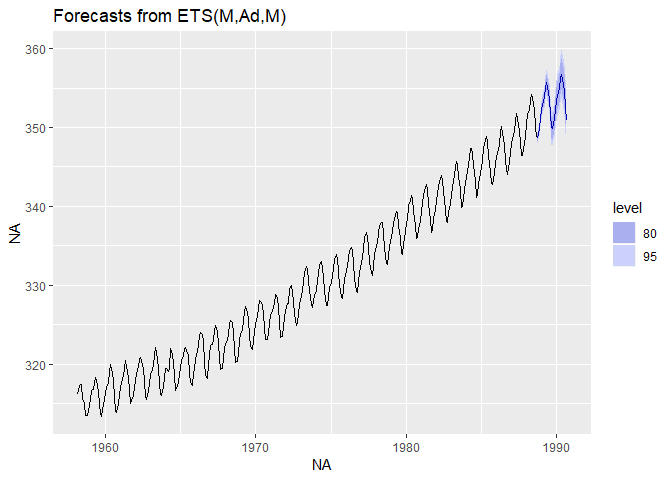
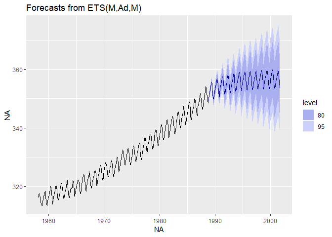
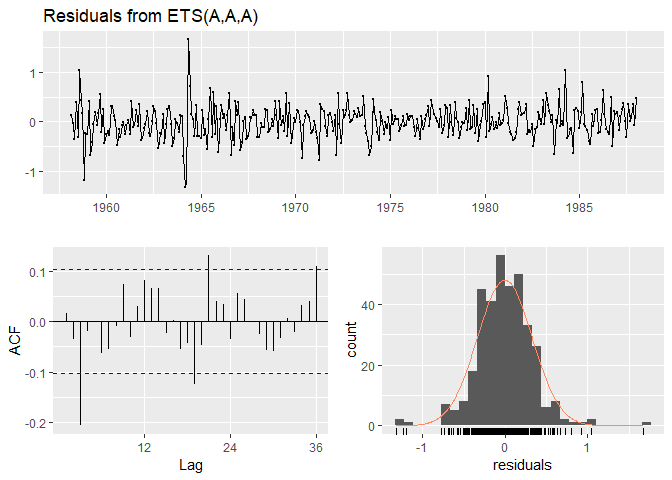
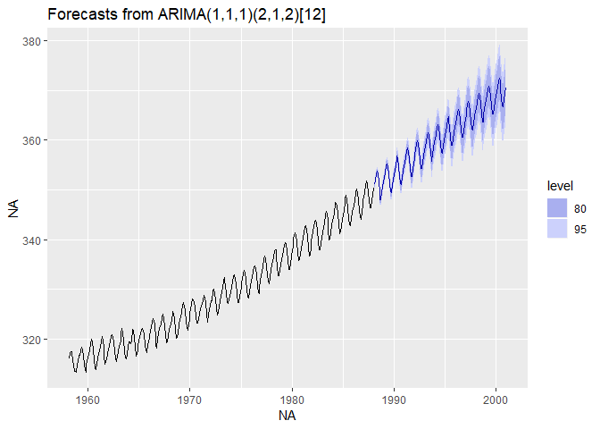
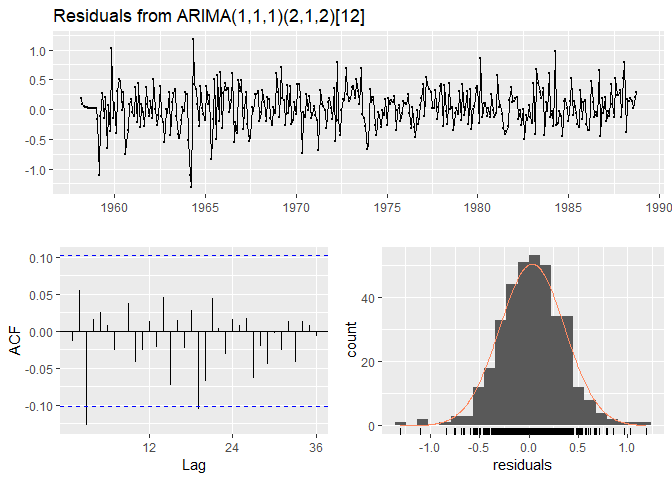

Introduction à la plateforme GitHub
================
zcoulibali
2019-04-05

Directives de l’évaluation
--------------------------

Les données du fichier `hawai.csv` comprennent les moyennes des mesures mensuelles de **CO2 atmosphérique** en ppm-volume collectées au Mauna-Loa Observatory à Hawaii de mars 1958 à juillet 2001, inclusivement.

Travail à faire
---------------

Le travail consiste à :

1.  créer une série temporelle du CO2 à partir des données de hawai.csv

2.  séparer la série en parties d'entraînement (environ 70% des données) et en partie test

3.  créer un modèle ETS sur les données d'entraînement, puis projeter la prévision de CO2 atmosphérique pour comparer aux données test

4.  effectuer une analyse des résidus

5.  commenter : le modèle est-il fiable ? Comment pourrait-il être amélioré ?

Enfin, le travail est remis sous forme de lien vers un répertoire git (GitHub, GitLab, etc.) comprenant un code reproductible de votre démarche en format R-markdown.

Résolution
----------

Charger le fichier de travail
-----------------------------

``` r
library(tidyverse)
```

    ## -- Attaching packages -------------------------------------------------------------------- tidyverse 1.2.1 --

    ## v ggplot2 3.1.0     v purrr   0.2.5
    ## v tibble  1.4.2     v dplyr   0.7.8
    ## v tidyr   0.8.2     v stringr 1.3.1
    ## v readr   1.3.1     v forcats 0.3.0

    ## -- Conflicts ----------------------------------------------------------------------- tidyverse_conflicts() --
    ## x dplyr::filter() masks stats::filter()
    ## x dplyr::lag()    masks stats::lag()

``` r
hawai <- read_csv("hawai.csv")
```

    ## Parsed with column specification:
    ## cols(
    ##   time = col_double(),
    ##   CO2 = col_double()
    ## )

### 1. Créer une série temporelle du CO2 à partir des données de hawai.csv

Exploration des données :

``` r
str(hawai)
```

    ## Classes 'spec_tbl_df', 'tbl_df', 'tbl' and 'data.frame': 526 obs. of  2 variables:
    ##  $ time: num  1958 1958 1958 1959 1958 ...
    ##  $ CO2 : num  316 317 317 317 316 ...
    ##  - attr(*, "spec")=
    ##   .. cols(
    ##   ..   time = col_double(),
    ##   ..   CO2 = col_double()
    ##   .. )

La fonction `read_csv()` n'a pas reconnu la variable `time` directement comme une date mais plutôt une variable numérique. On serait tenté de la transformer en format date. Mais la fonction `ts()` du module `lubridate`, qui crée un objet de format `ts`, sans forcément besoin du format date.

``` r
library(forecast)
```

    ## Warning: package 'forecast' was built under R version 3.5.3

Il faut garder que le vecteur ou la matrice temporelle `(excluant la date: time)` puis spécifier l'unité temporelle (ici l'année) et la sous-unité (le mois) de départ, et combien il y a de sous-unités par unité temporelle (ici 12 mois).

La série temporelle `hawai_ts` devient :

``` r
hawai_ts <- ts(hawai$CO2,         # le vecteur (cible)
                start = c(1958, 3), # départ au 3ième mois de 1958
                freq = 12)          # nombre de sous-unités par an freq = 12
sample(hawai_ts, 10)
```

    ##  [1] 355.350 320.250 368.850 324.975 346.440 368.750 358.320 364.560
    ##  [9] 348.750 332.550

### 2. Séparer la série en parties d'entraînement (environ 70% des données) et en partie test

Après une exploration du dataframe, la série commence en mars 1958 et termine en décembre 2001. Voyons s'il peut être affiché entièrement :

``` r
hawai_ts
```

    ##           Jan      Feb      Mar      Apr      May      Jun      Jul
    ## 1958                   316.1000 317.2000 317.4333 317.4333 315.6250
    ## 1959 315.5000 316.7000 316.7333 317.6750 318.3250 318.0250 316.5250
    ## 1960 316.3800 316.9750 317.5750 319.1200 319.9250 319.4500 318.0600
    ## 1961 316.9250 317.6500 318.5250 319.4200 320.4750 319.7500 318.3200
    ## 1962 317.9250 318.6250 319.6800 320.5500 320.9000 320.5000 319.4250
    ## 1963 318.7250 318.9667 319.8600 321.2750 322.1000 321.4600 319.6000
    ## 1964 319.4000 319.4000 319.1000 319.4000 322.0000 321.7500 320.3000
    ## 1965 319.4000 320.4500 320.9250 322.0000 322.0600 321.7750 321.0400
    ## 1966 320.5400 321.5750 322.3750 323.6600 324.0250 323.7000 322.8500
    ## 1967 322.4000 322.4250 323.0000 324.2800 324.9500 324.0750 322.4800
    ## 1968 322.5500 323.0500 323.9200 324.9750 325.4750 325.2600 324.0250
    ## 1969 323.9250 324.2750 325.6000 326.5750 327.2800 326.5500 325.8000
    ## 1970 325.0800 326.0250 327.0000 328.0750 327.9200 327.5500 326.3000
    ## 1971 326.1400 326.6500 327.2000 327.6750 328.8200 328.4750 327.2200
    ## 1972 326.7200 327.6250 327.7250 329.6400 330.0000 329.0750 328.0400
    ## 1973 328.5500 329.4750 330.3800 331.5750 332.4000 331.9400 330.6500
    ## 1974 329.3250 330.6250 331.5000 332.6250 332.9750 332.1600 331.0750
    ## 1975 330.2500 331.3000 332.0000 333.2750 333.8600 333.4000 331.8000
    ## 1976 331.7400 332.5500 333.4500 334.4500 334.7600 334.4000 332.8600
    ## 1977 332.8800 333.4250 334.7000 336.0400 336.6750 336.2000 334.8000
    ## 1978 335.0250 335.3500 336.6000 337.6400 337.9500 337.9250 336.5000
    ## 1979 336.2250 336.7000 338.0000 338.8750 339.3750 339.2400 337.5250
    ## 1980 337.9250 338.2250 340.0600 340.7500 341.3400 340.9500 339.3750
    ## 1981 339.2200 340.4500 341.4000 342.4500 342.8200 342.1250 340.4250
    ## 1982 340.7000 341.5500 342.6750 343.4750 343.9600 343.3000 341.9200
    ## 1983 341.3400 342.5000 343.1500 344.9000 345.6500 345.2750 343.8200
    ## 1984 343.6750 344.4250 345.1750 347.4000 347.3500 346.6600 345.2000
    ## 1985 344.9250 345.8750 347.4400 348.3250 348.8250 348.1800 346.4500
    ## 1986 346.2500 346.8250 347.7400 349.5250 350.0800 349.3750 347.8250
    ## 1987 348.0000 348.5000 349.4750 350.8500 351.7400 351.1500 349.4500
    ## 1988 350.4000 351.7750 352.1250 353.5800 354.1750 353.7500 352.2200
    ## 1989 352.7750 353.0000 353.6000 355.3600 355.6000 355.1250 353.8600
    ## 1990 353.6500 354.6500 355.4800 356.1750 357.0750 356.0800 354.6750
    ## 1991 354.6750 355.6500 357.2000 358.6000 359.2500 358.1800 356.0500
    ## 1992 355.9000 356.6800 357.9000 359.0750 359.5400 359.1250 357.0000
    ## 1993 356.6800 357.1750 358.4250 359.3250 360.1800 359.5000 357.4200
    ## 1994 358.3200 358.9000 359.9250 361.2200 361.6500 360.9000 359.4600
    ## 1995 359.9750 360.9250 361.5750 363.3600 363.7000 363.2500 361.8000
    ## 1996 362.0250 363.1750 364.0600 364.7000 365.3250 364.8800 363.4750
    ## 1997 363.1250 363.8750 364.5600 366.3250 366.6800 365.4750 364.3750
    ## 1998 365.3400 366.2000 367.3750 368.5250 369.1400 368.7500 367.6000
    ## 1999 368.1200 368.8500 369.6000 370.9750 370.8400 370.2500 369.0000
    ## 2000 369.0200 369.3750 370.4000 371.5400 371.6500 371.6250 369.9400
    ## 2001 370.1750 371.3250 372.0600 372.7750 373.8000 373.0600 371.3000
    ##           Aug      Sep      Oct      Nov      Dec
    ## 1958 314.9500 313.5000 313.5000 313.4250 314.7000
    ## 1959 314.9000 313.8250 313.4000 314.8750 315.5250
    ## 1960 315.7750 314.1750 313.8400 315.0250 316.2000
    ## 1961 316.7750 315.0400 315.3500 316.0500 316.9800
    ## 1962 317.7333 316.0667 315.4750 316.5500 317.5250
    ## 1963 317.6000 316.1500 316.0500 317.0000 318.3500
    ## 1964 318.5000 316.6000 316.9600 317.7250 318.6750
    ## 1965 318.7250 317.8250 317.3400 318.8750 319.3250
    ## 1966 320.2000 318.7000 318.1800 319.9000 321.0600
    ## 1967 320.8500 319.3000 319.4500 320.6750 321.9200
    ## 1968 321.9400 320.2500 320.2750 321.3200 322.9250
    ## 1969 323.5400 322.4000 321.8000 322.8200 324.1250
    ## 1970 324.6600 323.1500 323.1400 324.0500 325.1000
    ## 1971 325.2500 323.4000 323.5400 324.8250 325.9250
    ## 1972 326.2500 324.8600 325.3000 326.4250 327.5400
    ## 1973 329.3250 327.5000 327.2250 328.0500 328.6400
    ## 1974 329.2200 327.3750 327.3750 328.4000 329.6750
    ## 1975 329.9800 328.5250 328.3250 329.4400 330.7750
    ## 1976 330.7250 329.3500 329.1000 330.3500 331.6250
    ## 1977 332.8750 331.5750 331.2000 332.3500 333.8600
    ## 1978 334.6500 332.7400 332.6500 333.8250 334.9600
    ## 1979 336.0250 333.9800 333.9500 335.1500 336.6600
    ## 1980 337.6000 335.8750 336.0250 337.0600 338.2000
    ## 1981 338.4000 336.7000 336.9400 338.4250 339.6000
    ## 1982 339.6250 338.0250 337.9000 339.2750 340.4250
    ## 1983 342.1500 339.8750 340.0200 341.1500 342.9800
    ## 1984 343.3000 341.1200 341.4750 342.8500 344.1400
    ## 1985 344.3000 343.0000 342.8000 344.2200 345.5750
    ## 1986 345.8200 344.8000 344.1000 345.6200 346.8750
    ## 1987 348.0800 346.4000 346.4400 347.9250 348.9250
    ## 1988 350.3000 348.7500 348.9600 350.0000 351.3600
    ## 1989 351.5750 349.8600 350.0500 351.2000 352.4800
    ## 1990 352.9000 350.9400 351.2250 352.7000 354.1400
    ## 1991 353.8600 352.1250 352.2500 353.7400 355.0250
    ## 1992 354.8600 353.0250 353.4200 354.2000 355.3500
    ## 1993 355.3250 353.7750 354.0600 355.3500 356.7750
    ## 1994 357.3750 355.9250 356.0200 357.5750 359.0600
    ## 1995 359.3750 358.0000 357.8500 359.4750 360.7000
    ## 1996 361.3200 359.4000 359.6250 360.7400 362.3750
    ## 1997 362.4600 360.1500 360.7500 362.3800 364.2500
    ## 1998 365.7200 363.9250 364.3200 365.5500 366.9250
    ## 1999 366.7000 364.6750 365.1400 366.6500 367.9000
    ## 2000 367.9500 366.5400 366.7250 368.1250 369.4400
    ## 2001 369.4250 367.8800 368.0500 369.3750 371.0200

Tentons ce code pour trouver l'année et le mois où le partitionnement en Train et Test sets devrait s'arrêter :

``` r
hawai$time[round(0.7*nrow(hawai))]
```

    ## [1] 1988.75

Ce qui correspond au mois de septembre 1988. Nous pouvons donc partitionner en utilisant cette date comme limite de partitionnement :

``` r
hawai_ts_train <- window(hawai_ts, 
                         start = 1958, 
                         end = hawai$time[round(0.7*nrow(hawai))],
                         freq = 12)
```

    ## Warning in window.default(x, ...): 'start' value not changed

``` r
hawai_ts_test <- window(hawai_ts, 
                        start = hawai$time[round(0.7*nrow(hawai))],
                        freq = 12)
```

On pourrait visualiser le succès du partitionnement en appelant par exemple les données Test :

``` r
hawai_ts_test
```

    ##          Jan     Feb     Mar     Apr     May     Jun     Jul     Aug
    ## 1988                                                                
    ## 1989 352.775 353.000 353.600 355.360 355.600 355.125 353.860 351.575
    ## 1990 353.650 354.650 355.480 356.175 357.075 356.080 354.675 352.900
    ## 1991 354.675 355.650 357.200 358.600 359.250 358.180 356.050 353.860
    ## 1992 355.900 356.680 357.900 359.075 359.540 359.125 357.000 354.860
    ## 1993 356.680 357.175 358.425 359.325 360.180 359.500 357.420 355.325
    ## 1994 358.320 358.900 359.925 361.220 361.650 360.900 359.460 357.375
    ## 1995 359.975 360.925 361.575 363.360 363.700 363.250 361.800 359.375
    ## 1996 362.025 363.175 364.060 364.700 365.325 364.880 363.475 361.320
    ## 1997 363.125 363.875 364.560 366.325 366.680 365.475 364.375 362.460
    ## 1998 365.340 366.200 367.375 368.525 369.140 368.750 367.600 365.720
    ## 1999 368.120 368.850 369.600 370.975 370.840 370.250 369.000 366.700
    ## 2000 369.020 369.375 370.400 371.540 371.650 371.625 369.940 367.950
    ## 2001 370.175 371.325 372.060 372.775 373.800 373.060 371.300 369.425
    ##          Sep     Oct     Nov     Dec
    ## 1988         348.960 350.000 351.360
    ## 1989 349.860 350.050 351.200 352.480
    ## 1990 350.940 351.225 352.700 354.140
    ## 1991 352.125 352.250 353.740 355.025
    ## 1992 353.025 353.420 354.200 355.350
    ## 1993 353.775 354.060 355.350 356.775
    ## 1994 355.925 356.020 357.575 359.060
    ## 1995 358.000 357.850 359.475 360.700
    ## 1996 359.400 359.625 360.740 362.375
    ## 1997 360.150 360.750 362.380 364.250
    ## 1998 363.925 364.320 365.550 366.925
    ## 1999 364.675 365.140 366.650 367.900
    ## 2000 366.540 366.725 368.125 369.440
    ## 2001 367.880 368.050 369.375 371.020

Il reste ainsi 13 années fois 12 mois plus 3 mois soit h = 159 pour les données Test.

### 3.1 Créer un modèle ETS sur les données d'entraînement

R optimise le choix du meileur modèle avec la méthode ETS (`error, tend and seasonnal`). L’optimisation est lancée avec la fonction `ets()` du module `forecast`.

``` r
hawai_ets <- hawai_ts_train %>%
                  ets() %>%         # enregistre le modèle
                  forecast()        # affiche la composante prévisionnelle
```

Pour afficher la prédiction :

``` r
hawai_ets %>% 
  autoplot() + labs(x = "Année", y = "Concentration CO2")
```



Une prédiction est faite possiblement de 1988 à 1990. Les données Test permettront d'étendre un peu plus cette plage de prédiction.

On pourrait regarder les paramètres du modèle :

``` r
hawai_ets$model$par
```

    ##         alpha          beta         gamma             l             b 
    ##  6.802687e-01  2.259570e-03  1.015036e-04  3.145366e+02  1.126940e-01 
    ##            s0            s1            s2            s3            s4 
    ##  5.563618e-01 -8.727554e-02 -9.497972e-01 -2.004136e+00 -3.056502e+00 
    ##            s5            s6            s7            s8            s9 
    ## -2.878968e+00 -1.183077e+00  7.839500e-01  2.259468e+00  2.856629e+00 
    ##           s10 
    ##  2.384125e+00

### 3.2 Projeter la prévision de CO2 atmosphérique pour comparer aux données test

Faisons la projection sur une période de 159 mois correspondant à la plage des données Test.

``` r
hawai_ets <- hawai_ts_train %>%
                  ets() %>% 
                  forecast(h = 159)
```

La visualisation graphique donne cette fois :

``` r
hawai_ets %>% 
  autoplot() + labs(x = "Année", y = "Concentration CO2")
```



L’évaluation du modèle peut être effectuée avec la fonction `forecast::accuracy()` qui détecte automatiquement la série d’entraînement et la série de test si on lui fournit la série entière `hawi_ts`.

``` r
accuracy(hawai_ets, hawai_ts)
```

    ##                        ME     RMSE       MAE          MPE       MAPE
    ## Training set -0.001062961 0.330219 0.2482782 -0.000786347 0.07547246
    ## Test set      0.370393661 1.149941 0.8916896  0.098447563 0.24472812
    ##                   MASE       ACF1 Theil's U
    ## Training set 0.2032564 0.05170149        NA
    ## Test set     0.7299939 0.94392537 0.8938207

### 4. Effectuer une analyse des résidus

``` r
hawai_ets %>% 
  checkresiduals()
```



    ## 
    ##  Ljung-Box test
    ## 
    ## data:  Residuals from ETS(A,A,A)
    ## Q* = 45.022, df = 8, p-value = 3.645e-07
    ## 
    ## Model df: 16.   Total lags used: 24

### 5. Commenter : le modèle est-il fiable ? Comment pourrait-il être amélioré ?

La p-value du `Ljung-Box test` (&lt;&lt;&lt; 0.05) montre qu'il y a des tendances dans les données. Il est peu probable que les résidus aient été générés par un bruit blanc, indiquant qu’il existe une structure dans les données qui n’a pas été capturée par le modèle.

On pourrait tester le modèle ARIMA et apprecier l'amélioration éventuelle apportée.

``` r
hawai_arima <- hawai_ts_train %>% auto.arima()

hawai_arima %>% forecast(h=159) %>% 
                      autoplot() + labs(x = "Année", y = "Concentration CO2")
```



``` r
hawai_arima %>%
  checkresiduals()
```



    ## 
    ##  Ljung-Box test
    ## 
    ## data:  Residuals from ARIMA(1,1,1)(2,1,2)[12]
    ## Q* = 20.545, df = 18, p-value = 0.303
    ## 
    ## Model df: 6.   Total lags used: 24

Avec une p-value de 30.3%, le Ljung-Box test montre également que ce modéle serait meilleur que le modèle ETS.
